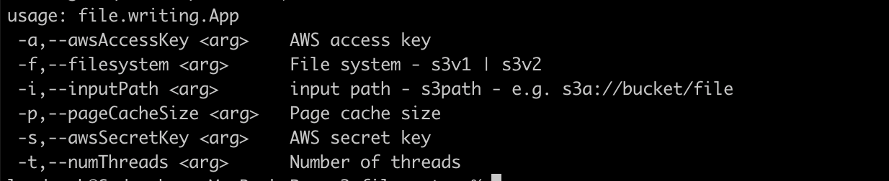

### Intent

The intent of this app is to test the sequential and random access read throughput in an EC2 instance against different backends

### Table of results

| Backend                | Sequential Read throughput                | Random access Read throuput                                                           |
|------------------------|-------------------------------------------|---------------------------------------------------------------------------------------|
| S3 with S3AFilesystem  | 170 MB/s  - 10MB page cache and 7 threads | 5.48 MB/s - 8KB record size, 8KB page cache, 7 threads                                |
| S3 with AWS SDK V2 api |                                           |                                                                                       |
| EBS - 300 IOPs         | 190 MB/s - 10MB page cache and 7 Threads  | 35 MB/s -  8KB record size, 8KB page cache, 7 threads                                 |
| EBS - 3000 IOPs        |   |                                                                                       |
| Simple file server     | 80 MB/s  - 10MB page cache and 7 threads  | 24 MB/s - 8KB record size, 8KB page cache, 100 records batched per request, 7 threads |

### Building

* Make sure java and gradle are installed locally
* Run command `gradle shadowjar`
* This will generate the jar we need : `./app/build/libs/app-all.jar`
* Run the app with the following options
  
  Example run command:

`java  -jar /tmp/app-all.jar -f s3v1 -i "s3a://<bucket>/<file>" -a $ACCESS_KEY -s $SECRET_KEY -p "10000000" -t 1`

### The commands to run

* S3 with S3AFileSystem
  * Sequential access: `java  -jar /tmp/app-all.jar --filesystem s3v1 --inputPath "s3a://<bucket>/<file>" --awsAccessKey $ACCESS_KEY --awsSecretKey $SECRET_KEY --pageCacheSize "10000000" --numThreads 1`
  * Random access: `java  -jar /tmp/app-all.jar --filesystem s3v1 --inputPath "s3a://<bucket>/<file>" --awsAccessKey $ACCESS_KEY --awsSecretKey $SECRET_KEY --numThreads 1 --accessType RandomAccess --numberOfRecords 10000 --recordSize 1048576`
* S3 with AWS SDK V2 api
  * Sequential access: `java  -jar /tmp/app-all.jar --filesystem s3v2 --inputPath "s3a://<bucket>/<file>" --awsAccessKey $ACCESS_KEY --awsSecretKey $SECRET_KEY --pageCacheSize "8388608" --numThreads 1`
  * Random access: `java  -jar /tmp/app-all.jar --filesystem s3v2 --inputPath "s3a://<bucket>/<file>" --awsAccessKey $ACCESS_KEY --awsSecretKey $SECRET_KEY --numThreads 1 --accessType RandomAccess --numberOfRecords 10000 --recordSize 1048576`
* EBS
  * Sequential access: `java  -jar /tmp/app-all.jar --filesystem ebs --inputPath "/path/to/file" --pageCacheSize "8388608" --numThreads 1`
  * Random access: `java  -jar /tmp/app-all.jar --filesystem ebs --inputPath "/path/to/file" --numThreads 1 --accessType RandomAccess --numberOfRecords 100000 --recordSize 1048576`
* File server
  * Random access: `java  -jar /tmp/app-all.jar --filesystem fileServer --fileServerHost 127.0.0.1 --fileServerPort 9000 --inputPath "/path/to/file" --numThreads 1 --numberOfRecords 100000 --recordSize 1048576 --numberOfRecordsPerFileServerRequest 10`
  * Sequential access: `java  -jar /tmp/app-all.jar --filesystem fileServer --fileServerHost 127.0.0.1 --fileServerPort 9000 --inputPath "/path/to/file" --pageCacheSize "8192" --numThreads 1 --dataPerFileServerRequest 1048576`

### Monitoring 

* Run the following commands
    * `vnstat -l -ru`
    * This will give IO throughput

### Results

* aws cli throughput: we get around 100 MBps
* Using s3v1, with 1 thread, we get 21 MBps
  * `java  -jar /tmp/app-all.jar -f s3v1 -i "s3a://<bucket>/<file>" -a $ACCESS_KEY -s $SECRET_KEY -p "10000000" -t 1`
* Using s3v1, with 10 threads, we get 90 MBps
  * `java  -jar /tmp/app-all.jar -f s3v1 -i "s3a://<bucket>/<file>" -a $ACCESS_KEY -s $SECRET_KEY -p "10000000" -t 10`
* Using s3v2, with 1 thread, we get 12 MBps
  * `java  -jar /tmp/app-all.jar -f s3v2 -i "s3a://<bucket>/<file>" -a $ACCESS_KEY -s $SECRET_KEY -p "10000000" -t 1`
* Using s3v2, with 10 threads, we get 100 MBps
  * `java  -jar /tmp/app-all.jar -f s3v2 -i "s3a://<bucket>/<file>" -a $ACCESS_KEY -s $SECRET_KEY -p "10000000" -t 10`

### Getting EC2 instance ready

* `wget --no-check-certificate -c --header "Cookie: oraclelicense=accept-securebackup-cookie" https://download.oracle.com/java/17/latest/jdk-17_linux-x64_bin.rpm`
* `sudo rpm -Uvh jdk-17_linux-x64_bin.rpm`
* `yum install iotop`
* `sudo amazon-linux-extras install epel -y`
* `sudo yum-config-manager --enable epel`
* `sudo yum --enablerepo=epel install vnstat`